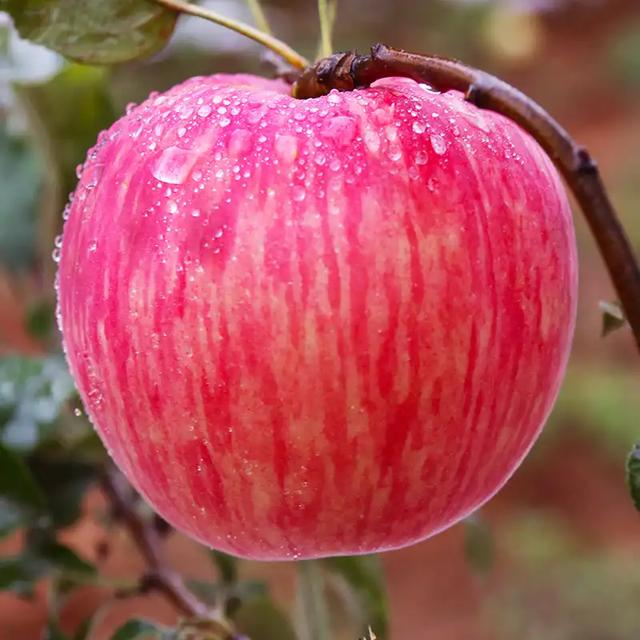
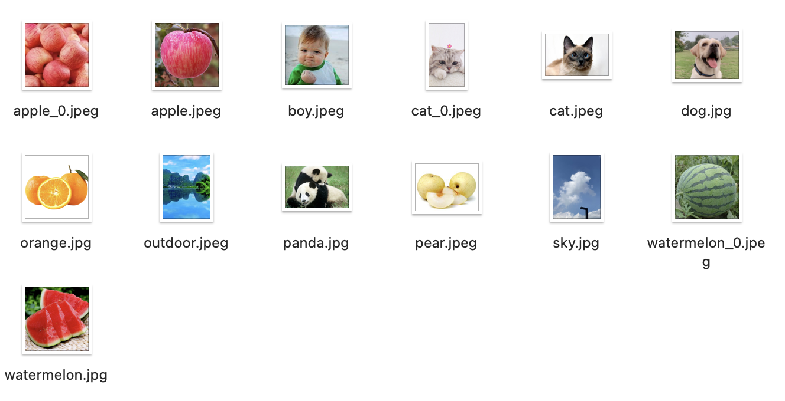

<p align="center">
  
</p>

# clip.cpp

Inference of clip model in pure C/C++

## Features

- Plain C/C++ implementation based on [ggml](https://github.com/ggerganov/ggml)
-  OPENAI clip model support
    - openai-clip-vit-base-patch32
    - openai-clip-vit-large-patch14
    - openai-clip-vit-large-patch14-336
    - openai-clip-vit-base-patch16
-  OFA-Sys chinese clip support
    - ofasys_chinese_clip_vit_huge_patch14,
    - ofasys_chinese_clip_vit_large_patch14_336,
    - ofasys_chinese_clip_vit_base_patch16,
    - ofasys_chinese_clip_vit_large_patch14

- 16-bit, 32-bit float support
- 8-bit integer quantization support
- Accelerated memory-efficient CPU inference
- AVX, AVX2 and AVX512 support for x86 architectures
- Metal backend for GPU acceleration.
- Supported platforms
    - Linux
    - Mac OS

### Download weights

- download original weights( .bin or .safetensors) For example
    - openai clip
      - openai/clip-vit-base-patch32 from https://huggingface.co/openai/clip-vit-base-patch32/tree/main
      - openai/clip-vit-large-patch14 from https://huggingface.co/openai/clip-vit-large-patch14/tree/main
      - openai/clip-vit-large-patch14-336 from https://huggingface.co/openai/clip-vit-large-patch14-336/tree/main
      - openai/clip-vit-base-patch16 from https://huggingface.co/openai/clip-vit-base-patch16/tree/main

    - ofasys chinese clip 
      - ofasys_chinese_clip_vit_huge_patch14 from https://huggingface.co/OFA-Sys/chinese-clip-vit-huge-patch14
      - ofasys_chinese_clip_vit_large_patch14_336 from https://huggingface.co/OFA-Sys/chinese-clip-vit-large-patch14-336px
      - ofasys_chinese_clip_vit_base_patch16 from https://huggingface.co/OFA-Sys/chinese-clip-vit-base-patch16
      - ofasys_chinese_clip_vit_large_patch14 from https://huggingface.co/OFA-Sys/chinese-clip-vit-large-patch14

### Build

#### Build from scratch

```shell
mkdir build
cd build
cmake ..
cmake --build . --config Release
```

##### Using Metal

```
cmake .. -DGGML_METAL=ON
make -j4
```
### Run

```
Usage: ./clip [options]

Options:
  -h, --help: Show this message and exit
  -m <path>, --model <path>: path to model
  --model_version: the clip model version [openai_clip_vit_base_patch32,openai_clip_vit_large_pathc14,openai_clip_vit_large_patch14_336 and list above model]
  --mode: clip mode must be one of [zeros_shot_image_classification,text_search_image],default = text_search_image
  --model_type: clip model type choose from [f32,f16,q8_0],default = GGML_TYPE_Q8_0 
  --image_path <path>: path to an image file for zeros_shot_image_classify 
  --label_path:txt file for zeros_shot_image_classification
  --text:  the text for text_search_image
  --img_directory: the image directory for text_search_image  
```

#### model convert
```python3 
 python3 convert_model/convert.py -model_dir ../clip_model/openai-clip-vit-base-patch32/ -convert_type f16 -output_dir ./ 
```

#### zeros_shot_image_classification example
```sh
## for openai clip 
./build/clip  -m  convert_model/patch32_clip_f16.gguf   --model_version openai_clip_vit_base_patch32 --mode zeros_shot_image_classification --model_type q8_0 --image_path example/images/apple.jpeg --label_path  example/label_english.txt
```

```sh
## for chinese_clip
./build/clip  -m  chinese_clip_vit_huge_patch14.gguf   --model_version ofasys_chinese_clip_vit_huge_patch14 --mode zeros_shot_image_classification --model_type q8_0 --image_path example/images/apple.jpeg --label_path  example/label_chinese.txt
```
<p align="center">
  
</p>

```txt
label:example/images/apple.jpeg
苹果的照片                                                           :0.311196
梨的照片                                                             :0.219238
蓝色天空的照片                                                        :0.207216
```
#### text_search_image example
<p align="center">
  
</p>

```sh
## openai clip 
 ./build/clip  -m openai_clip_vit_base_patch32.gguf  --model_version openai_clip_vit_base_patch32 --mode text_search_image --model_type q8_0   --img_directory example/images --text "a photo of apple"
```
```sh
## chinese clip 
 ./build/clip  -m  chinese_clip_vit_large_patch14_336.gguf --model_version ofasys_chinese_clip_vit_large_patch14_336 --mode  text_search_image --model_type q8_0   --img_directory example/images --text "男孩照片"
```

```txt
label:男孩照片
example/images/boy.jpeg                                                  :0.270299
example/images/cat.jpeg                                                  :0.256663
example/images/panda.jpg                                                 :0.246492
```
<p align="center">
  
</p>
## References

- [ggml](https://github.com/ggerganov/ggml)
- [stable-diffusion.cpp](https://github.com/leejet/stable-diffusion.cpp)
- [clip](https://github.com/openai/CLIP)

